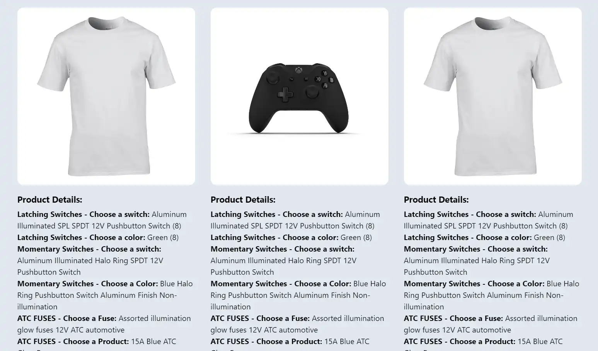

## Buildateam Code Challenge

README на русском: [README_RU.md](README_RU.md)

Frontend page: 

> Ignore the ngrok warning and click "Visit Site"

### Build Instructions

1. Create a `.env` file in the root directory. Include your Shopify access token and store name.

```env
SHOPIFY_ACCESS_TOKEN=shpat_78d...
SHOPIFY_STORE_NAME=shop-address.myshopify.com
```

2. Install root dependencies:

```
npm install
```

3. In the client folder, install dependencies and build:

```
cd client
npm install
npm run build
cd ..
```

4. Set up the database and start the server:

```
node setup_database.js
node express.js
```

The server runs locally, combining backend logic while also serving the client at http://localhost:5050/.

### Testing

```
npm run test
```

### Development Process

#### Day 1

Researched potential project structures. Despite the challenge specifying a Node.js server and React/Redux frontend, multiple approaches fit. Originally considered Next.js for its seamless integration and features but eventually chose a simpler Express server setup to keep the backend manual operations straightforward.

#### Day 2

Configured the server to fetch and cache data from Shopify. Restructured the data for efficiency. Set up the frontend with React/Redux and other libraries. Used Tailwind CSS for styling and implemented logic preserving image aspect ratios on canvas. Cleaned up bodyHtml for display.

#### Day 3

Utilized ngrok for public client URL serving. Implemented a simple SQLite database for server-side product storage. Added unit testing for the api/products endpoint.
